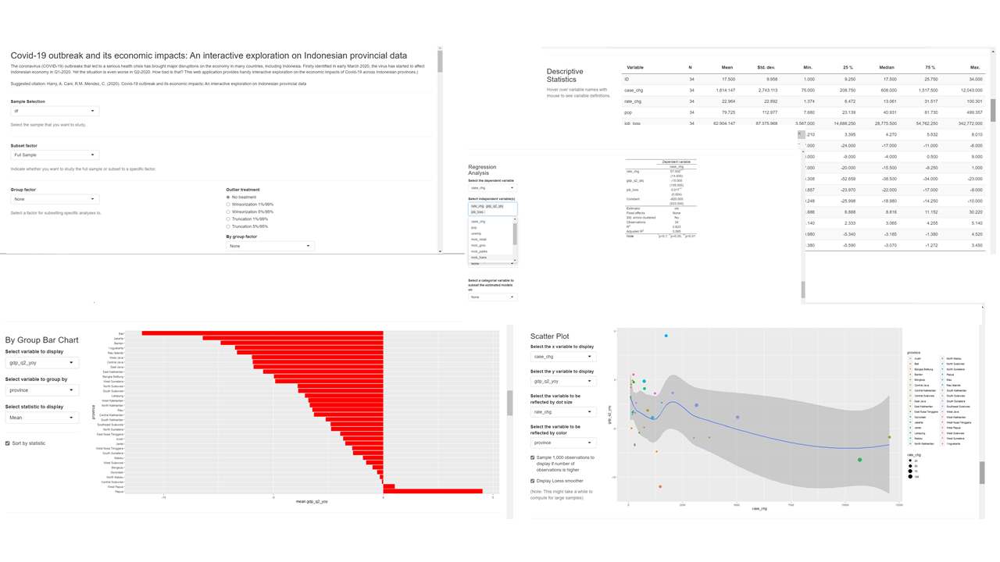

The coronavirus (Covid-19) outbreaks that led to a serious health crisis has brought major disruptions on the economy in many countries, including Indonesia. Firstly identified in early March 2020, the pandemic has started to affect Indonesian economy in Q1-2020. Yet the situation is even worse in Q2-2020. How bad is that? This publication is intended to explore the economic impacts of Covid-19 pandemic across Indonesian provinces from Q1 to Q2-2020. Apart from Covid-19 cases and economic growth data, we also include jobs and community mobility data from Google to capture the impact of Covid-19 outbreaks on regional employment and people mobility.

Suggested Citation: 

> Harry, A. Cani, R.M, Mendez, C (2020). _Covid-19 pandemic and its economic impacts: An interactive exploration on Indonesian provincial data._ Available at https://rpubs.com/haginta/covid19-econ-impacts-indonesia.

This work is licensed under the Creative Commons Attribution-Share Alike 4.0 International License. 
{width=75px}

<style>
h1.title {font-size: 18pt; color: DarkBlue;} 
body, h1, h2, h3, h4 {font-family: "Palatino", serif;}
body {font-size: 12pt;}
/* Headers */
h1,h2,h3,h4,h5,h6{font-size: 14pt; color: #00008B;}
body {color: #333333;}
a, a:hover {color: #8B3A62;}
pre {font-size: 12px;}
</style>


```{r message=FALSE, warning=FALSE}
knitr::opts_chunk$set(echo = TRUE, warning=FALSE)

library(tidyverse)  # Modern data science workflow
library(sf)         # Simple features for R
library(tmap)       # Thematic Maps
library(tmaptools)  # Thematic Maps Tools
library(RColorBrewer) # ColorBrewer Palettes
library(leaflet)    # Interactive web maps
library(rgdal)      # Bindings for the Geospatial Data Abstraction Library
library(rgeos)      # Interface to Geometry Engine - Open Source 
library(ExPanDaR)

# Change the presentation of decimal numbers to 4 and avoid scientific notation
options(prompt="R> ", digits=4, scipen=999)
```


# Load non-spatial data

```{r}
library(readxl)
data <- read_excel("explore expandr.xlsx", 
    sheet = "Sheet1")
View(data)
```

```{r}
df <- data %>% select(-c(4:7,9:12))
```

# Load dataframe of definitions
```{r}
library(readr)
df_definitions <- read_delim("df_def.csv", ";", escape_double = FALSE, 
    trim_ws = TRUE)
df_definitions
```

# Load shape file of Indonesian provinces
```{r}
map <- read_sf("province border.shp")
```

# Merge non-spatial data with spatial data
```{r}
covid_map <- inner_join(
  df,
  map,
  by = "ID"
)
```

```{r}
covid_map
```

# Store data as sf object
```{r}
covid_map1 <- st_as_sf(covid_map)
```

# How the number of cumulative cases changes from March to June 2020?
```{r}
tmap_mode("plot")
tm_shape(covid_map1) +
  tm_polygons(c("case_chg", "rate_chg"), id = "province", palette=list("Reds", "Greens"), title=c("Change in number of cumulative cases (Mar to Jun)", "Change in rate of cumulative cases (Mar to Jun)")) +
tm_fill(style="kmeans") +
tm_layout(legend.title.size = 0.6,
          legend.text.size = 0.5,
          legend.position = c("left","bottom"))
```

#  How jobs and people mobility are affected?
```{r}
tmap_mode("plot")
tm_shape(covid_map1) +
  tm_polygons(c("job_loss", "mob_work"), id = "province", palette=list("Blues", "Reds"), title=c("Number of jobs affected", "Mobility to work compared to baseline")) +
tm_fill(style="kmeans") +
  tm_layout(legend.title.size = 0.5,
          legend.text.size = 0.4,
          legend.position = c("left","bottom"))
```

#  How much is growth impact in Q2-2020 (yoy and qtq)?
```{r}
tmap_mode("plot")
tm_shape(covid_map1) +
  tm_polygons(c("gdp_q2_yoy", "gdp_q2_qtq"), id = "province", palette=list("Reds", "Blues"), title=c("GDP growth Q2-2020 (yoy)", "GDP growth Q2-2020 (qtq)")) +
tm_fill(style="kmeans") +
  tm_layout(legend.title.size = 0.6,
          legend.text.size = 0.5,
          legend.position = c("left","bottom"))
```

Most of provinces recorded negative growth rate in Q2-2020. However, some provinces were able to maintain positive growth rate. They are West Papua and Papua (for yoy growth) and West Nusa Tenggara, East Nusa Tenggara, Papua, Central Sulawesi (for qtq growth).


#  How economic structure is related to growth impact in Q2-2020?
```{r}
tmap_mode("plot")
tm_shape(covid_map1) +
  tm_polygons(c("gdp_q2_yoy", "THS_share_gdp"), id = "province", palette=list("Reds", "Blues"), title=c("GDP growth Q2-2020 (yoy)", "THS share to GDP (%)")) +
tm_fill(style="kmeans")+
  tm_layout(legend.title.size = 0.6,
          legend.text.size = 0.5,
          legend.position = c("left","bottom"))
```

Provinces like Bali, Yogyakarta and Jakarta with higher share of transportation, tourism and services sector in GDP suffer larger negative impact in growth.

# Interactive map

```{r}
tmap_mode("view")
```

```{r}
tm_shape(covid_map1) + 
  tm_fill("gdp_q2_yoy",
          palette = "viridis",
          id="province",
          popup.vars=c("case_chg", "rate_chg", "job_loss", "mob_work", "gdp_q2_yoy", "gdp_q2_qtq")) + 
   tm_borders(alpha=.4) +
    tm_legend(outside=TRUE) +
  tm_layout(frame = FALSE) 
```

# Interactive exploration

```{r eval=FALSE, include=FALSE}
df1 <- df %>% select(-c(1)) %>% 
  mutate(Prov = province)
```

```{r eval=FALSE, include=FALSE}
df1 <- df1 %>%
  select(Prov, everything()) %>% 
  select(-province,province)
```

```{r eval=FALSE, include=FALSE}
library(readr)
df_def1 <- read_delim("df_def1.csv", ";", escape_double = FALSE, 
    trim_ws = TRUE)
df_def1
```

```{r eval=FALSE, include=FALSE}
# Run it in the console
ExPanD(
  df1,
 df_def = df_def1,
  export_nb_option = TRUE,
 title = "Covid-19 pandemic and its economic impacts: An interactive exploration on Indonesian provincial data",
  abstract = paste("The coronavirus (Covid-19) outbreaks that led to a serious health crisis has brought major disruptions on the economy in many countries, including Indonesia. Firstly identified in early March 2020, the virus outbreaks has started to affect Indonesian economy in Q1-2020. Yet the situation is even worse in Q2-2020. How bad is that? Find out more with this web application, which is intended to provide handy interactive exploration on the economic impacts of Covid-19 across Indonesian provinces.)
</br>
</br>
Suggested citation: Harry, A. Cani, R.M. Mendez, C. (2020). Covid-19 pandemic and its economic impacts: An interactive exploration on Indonesian provincial data")
  )
```

```{r eval=FALSE, include=FALSE}
config_list_fromRDS <- readRDS("covid19.RDS")
```


```{r eval=FALSE, include=FALSE}
# Run it in the console
ExPanD(
  df1,
  df_def = df_def1,
  export_nb_option = TRUE,
  config_list = config_list_fromRDS,
  title = "Covid-19 pandemic and its economic impacts: An interactive exploration on Indonesian provincial data",
  abstract = paste("The coronavirus (Covid-19) outbreaks that led to a serious health crisis has brought major disruptions on the economy in many countries, including Indonesia. Firstly identified in early March 2020, the virus outbreaks has started to affect Indonesian economy in Q1-2020. Yet the situation is even worse in Q2-2020. How bad is that? Find out more with this web application, which is intended to provide handy interactive exploration on the economic impacts of Covid-19 across Indonesian provinces.)
</br>
</br>
Suggested citation: Harry, A. Cani, R.M. Mendez, C. (2020). Covid-19 pandemic and its economic impacts: An interactive exploration on Indonesian provincial data")
  )
```

For further interactive data exploration, please visit the link below: 

https://haginta.shinyapps.io/Covid19_econ_impacts_reg_Indonesia/

{width=500px}

# References

- <https://joachim-gassen.github.io/ExPanDaR/>
- <https://cran.r-project.org/web/packages/ExPanDaR/index.html>