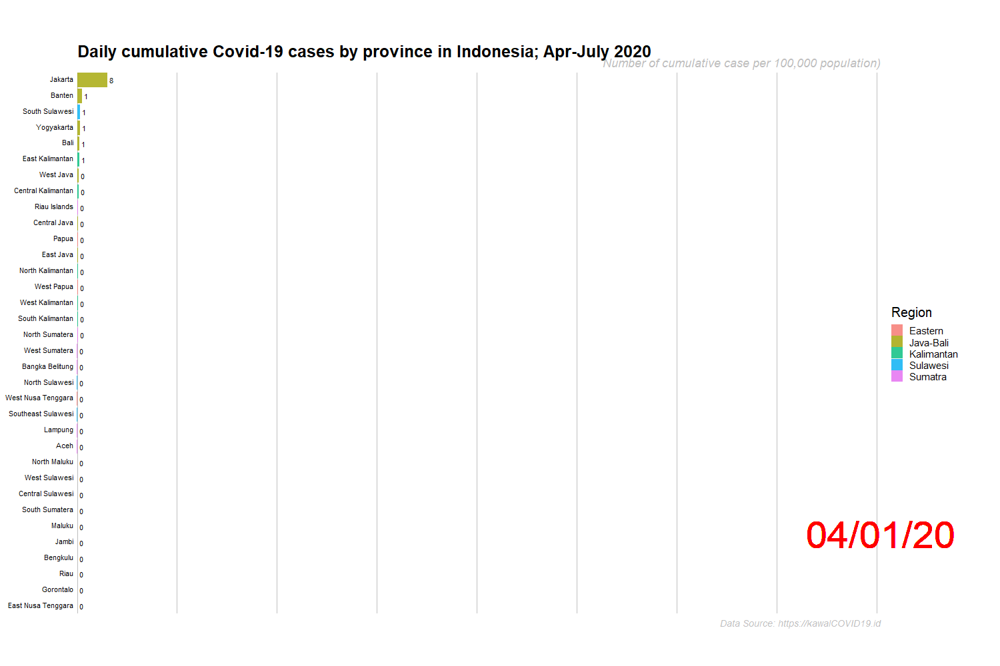
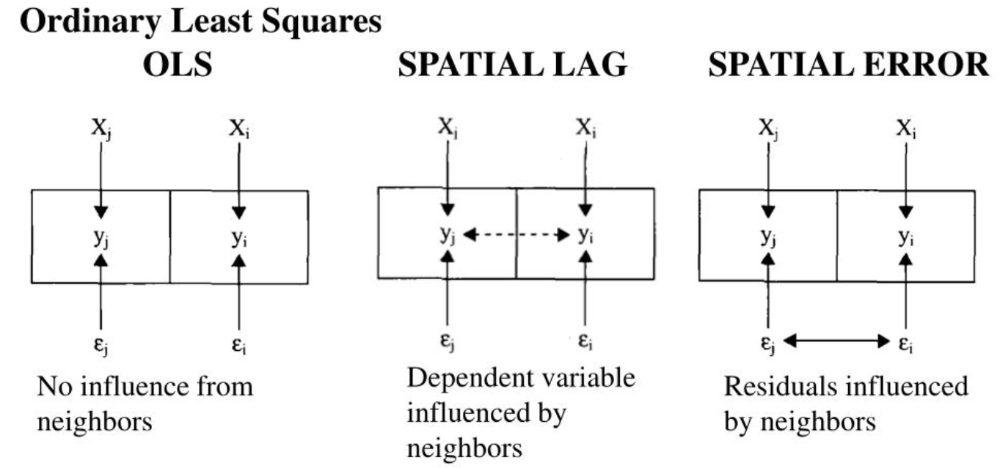
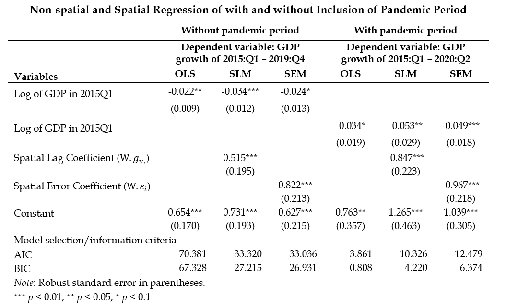

```{r setup, include=FALSE}
options(htmltools.dir.version = FALSE)
```

```{r xaringan-themer, include=FALSE, warning=FALSE}
library(xaringanthemer)
style_mono_light(
  background_color = "#FFF",
  text_font_family = xaringanthemer_font_default("text_font_family"),
  base_font_size = "18px",
   text_font_base = "sans-serif",
  header_font_google = google_font("Yanone Kaffeesatz")
)
```


## Introduction:
- COVID-19 leads to supply and demand shocks (Baldwin and Weder di Mauro 2020)
    - Negative supply shock stemming from reduction in production capacity (Hausmann, 2020; Inoue and Todo, 2020)
    - Declining workers' income leads to a shrinking in demand (Gourinchas, 2020)

--
--

-  Indonesia's economic growth in 2020 is projected to contract to –3.8% (OECD, 2020)

--
--

- Regionally, the negative impacts of COVID-19 on growth have been observed in Q2-2020, albeit vary in magnitude.

--
--
  
## Objectives:
- To provide initial exploration on the connection between COVID-19, the policy and regional economic growth 

--
--

- To study the difference of regional convergence and spatial spillovers between two periods; before and after pandemic


---

class: middle

## Methods:
- Exploratory data analysis

--
--

- Spatial econometrics

--
--

## Data:

- Exploratory data analysis
    - GDP (BPS), output gap (own computation), number of COVID-19 cases **([https://kawalCOVID19.id](https://kawalCOVID19.id))**, people's mobility **([Google mobility](https://www.google.com/covid19/mobility/))**, number of lost jobs (Ministry of Manpower)
    - Period: Q2-2020
    
--
--

- Spatial econometrics
    - Quarterly provincial real GDP
    - GDP growth 2015:Q1-2019:Q4 (without pandemic period)
    - GDP growth 2015:Q1-2020:Q2 (with pandemic period)

---

class: middle

# (1) Exploratory data analysis

- Negative output gap, economy below its potential level

--
--

- Lowest economic growth in Q2-2020 mostly in Java-Bali region 

--
--

- Negative correlation between people’s mobility and the change in number of COVID-19 cases and the share of TAS (Transportation, Accommodation and Services) in GDP

--
--

- GDP growth is more connected to number of jobs loss and TAS share in GDP

--
--

- The change in number of COVID-19 case is positively correlated with the share of TAS in GDP

---
class: middle, center

**COVID-19 cases in Indonesian provinces (daily comulative, Apr-July 2020)**



---
class: middle, center

**Correlation between COVID-19 cases, economic growth, jobs lost, people's mobility and TAS share in GDP**


Further interactive exploration is available. <br/> **[https://haginta.shinyapps.io/covid19-econ-impacts-indonesia/](https://haginta.shinyapps.io/covid19-econ-impacts-indonesia/)**


---

class: center, middle

# (2) Convergence and spatial spillovers

Classical convergence (intuition)

Spatial dependence (intuition)


---
class: middle

# Beta convergence framework (brief overview)

$$\begin{equation}\ln \left(\frac{\gamma_{i, t+k}}{y_{i, t}}\right)=\alpha+\beta \ln \left(\gamma_{i, t}\right)+\varepsilon_{i t}\end{equation}$$
The convergence hypothesis: negative and significant $\beta$, implying catching-up process or $\beta$ convergence (Rey and Montouri, 1999)

---
class: middle

# Spatial dependence (brief overview)

- Global spatial autocorrelation or Moran's I (Anselin, 2007)

$$I=\sum_{i} \sum_{j} w_{i j} \cdot\left(x_{i}-\mu\right) \cdot\left(x_{j}-\mu\right) / \sum_{i}\left(x_{i}-\mu\right)^{2}$$
where $w_{ij}$ is spatial weight matrix (we use inverse distance), $x_{i}$ is the score of the variable in location $i$, and $x_{j}$ is the score of the variable in location $j$, and $\mu$ is he cross-sectional mean of the variable. 

- Spatial econometric model

Spatial lag model (SLM)
$$g_{y_{i}}=\gamma+\beta \log y_{i, 0}+\rho \mathbf{W} g_{y_{i}}+\varepsilon_{i}$$
Spatial error model (SEM)
$$g_{y_{i}}=\gamma+\beta \log y_{i, 0}+(\mathbf{I}-\lambda \mathbf{W})^{-1} \varepsilon_{i}$$
where $g_{y_{i}}$ is the growth rate from initial to final period, $y_{i, 0}$ is GDP at the initial period, and $\mathbf{W}$ is spatial weight matrix.

---
class: middle

# Spatial lag model and spatial error model (conceptual comparison)


Source: 
Baller, R., L.Anselin, S.Messner, G.Deane and D.Hawkins (2001)

---
class: middle, center

# (3) Main results


**Spatial dependence of provincial economic growth** 

Without vs with pandemic period: spatial cluster vs spatial heterogeneity


---
class: middle, center

# (3) Main results (cont...)

**Cpmparison between non-spatial and spatial models** 




---
class: middle

## Discussion

- In all models and all periods, there is $\beta$ convergence  

--
--

- Both for SLA and SEM, the spatial coefficients are positive (significant) in without pandemic and negative (significant) with pandemic period

--
--

- The positive spatial coefficients imply positive spillovers from neighboring provinces (McCulloch and Sjahrir, 2008)

--
--

- Negative spatial coefficients indicates weakening growth spillovers effect when the pandemic period is included in the observation, resulting in an unsynchronized spatial growth. This may reflect the disconnection of economic interaction among people across provinces during ‘lock-down period’ due to pandemic.

---

class: middle

# Conclusion and implications
- The negative impact of COVID-19 pandemic on Indonesian economy is significant, massive decline of economic growth in Q2-2020. 

--
--

- Regionally, there is positive (negative) growth spillovers before (after) pandemic

--
--

- The negative spatial spillover due to the inclusion of pandemic period may reflect the disconnection of economic interaction among provinces during ‘the lock-down period’

--
--

- Short-term: identify the resilient economic sectors in their respective province, stimulus to sustain local economy, cushion for the most vulnerable

--
--

- Long-term: diversify the sources of economic growth across provinces, including by bringing the digital economy closer to the society

## Limitation

- Need to consider other weight matrix 
- Data used in the models are very limited to explain the complex regional growth dynamics
- Future studies: incorporate more variables, including the institutional determinants of growth

---

class: center, middle

# Thank you very much for your attention

**https://haginta.github.io/Harry-Aginta/**

Slides and working paper available at: http://bit.ly/jasid2019n 


**Quantitative Regional and Computational Science lab**

**https://quarcs-lab.org/** <br/>


***


